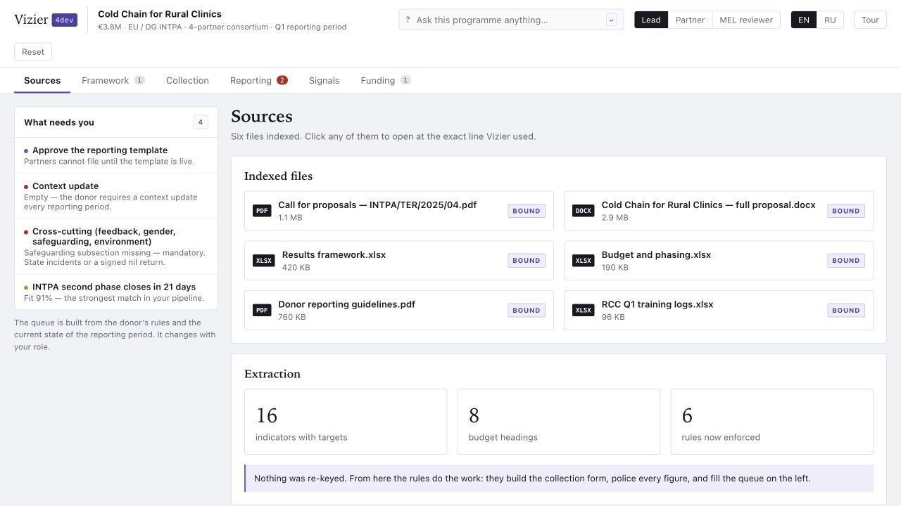

# Vizier4Dev

Quarterly reporting workspace for grant-funded consortia. Two self-contained HTML files, no build step, no dependencies, no network calls.

[](https://vizier4dev.pages.dev/)

- `index.html` — the demo workspace. Open it in a browser.
- `landing.html` — the public page describing it, linking to the demo.

## What it demonstrates

A reporting period for a four-partner, EU-funded action, run end to end:

1. **Sources** — grant documents are indexed; every figure keeps a link back to the file and line it came from.
2. **Framework** — indicators, targets, budget headings and six donor rules are extracted, and each rule is bound to the field it will police.
3. **Collection** — partners file results and cost lines. Figures are checked while they are typed: disaggregation that does not reconcile, a numerator above its denominator, a percentage below the framework floor, a narrative too thin to use, and two of a partner's own sources disagreeing on the same total.
4. **Costs and audit** — cost lines are checked against documented reasons costs are declared ineligible: personnel time with no signed timesheet, procurement above the threshold with no comparison of offers, a cost dated outside the period, a cost not linked to any output, a bonus that is not eligible. The screen carries two numbers: what was declared, and what would not survive a check today.
5. **Partner boundary** — each partner checks its own evidence where it sits and sends the verdict, not the file. The sign-in sheets, payroll, invoices and registers stay at the organisation holding them; what crosses is the figures the donor asks for, the status of each local check in one of four words, and a digest binding the figure to the evidence it was checked against. A gap opens a second round of a few dozen bytes rather than a folder. The screen counts both sides — what crossed, and what did not.
6. **Reporting** — narrative drafted from the same data, reviewer comments routed to the exact line, consolidation once all returns are approved.
7. **Hand-over** — the approved figures are encoded for a donor results system (with an indicator-mapping gate) or assembled into a structured interim form with its sub-chapters.
8. **Signals and funding** — control room, learning questions, and a funding pipeline with a draft-proposal review.

A role switcher (lead / partner / MEL reviewer) changes both permissions and the work queue on the left, which is rebuilt from the donor rules and the state of the period.

### On the boundary

A consortium that mails spreadsheets has already transferred everything, and the only question left is who bothers to read it. The claim the boundary makes is narrower and checkable: this many bytes left the building, and no others.

The digest lets the lead tell that a partner has not changed a register underneath an approved return. It does not prove the register was right in the first place, does not establish who compiled it, and is not an audit — a donor auditor still visits the partner and reads the file. The check verdicts cross as fixed words (`MET`, `NOT_MET`, `UNKNOWN`, `NOT_APPLICABLE`) so there is nothing for prose to soften on the way out.

## Languages

English and Russian, switchable in the top bar of both files; the choice is remembered in `localStorage`.

What Vizier says to you is translated. What comes out of the donor's own documents — indicator codes and labels, form field labels, file contents, budget headings, partner names — stays in the donor's language, because that is what gets submitted and what an auditor reads.

## Status

Working demo on fictional data. No account, no storage, no service behind it. No customers, no pilots.

The programme, the partners and every figure are invented. The rules the demo enforces follow published guidance on EU grant reporting and audit findings; thresholds and the reporting period belong to a grant agreement and change per action.

Not legal, financial, compliance or audit advice. Human review is required before anything is filed with a donor.

## Deployment

`./deploy.sh` validates and publishes `index.html`, `landing.html`, `robots.txt` and `_headers` to Cloudflare Pages. Only those four files are served; nothing else in the repository is.

Locally it uses the existing `wrangler` login. The manual GitHub Actions workflow
`.github/workflows/deploy.yml` uses the repository secrets
`CLOUDFLARE_API_TOKEN` and `CLOUDFLARE_ACCOUNT_ID`, making the deployment path
reproducible without relying on an untracked local Git hook.

The published site is closed to search engines — `robots.txt` disallows crawling
and `_headers` sends `X-Robots-Tag`. The same file sets CSP, content-type,
referrer, permissions, and opener policies. It is still reachable by anyone
holding the address, so the demo contains fictional data only.

## Checks

```bash
python3 scripts/check_static.py
```

CI verifies both pages, their local links, bilingual contract, absence of network
APIs/external scripts, and the required response headers.

## Open items

- The founder paragraph and the price block on `landing.html` are marked as drafts. They must be filled in or removed before the page is shown to anyone outside a working conversation.
- The contact link points at a personal mailbox; a domain address is the fix.

## License

[MIT](LICENSE)
