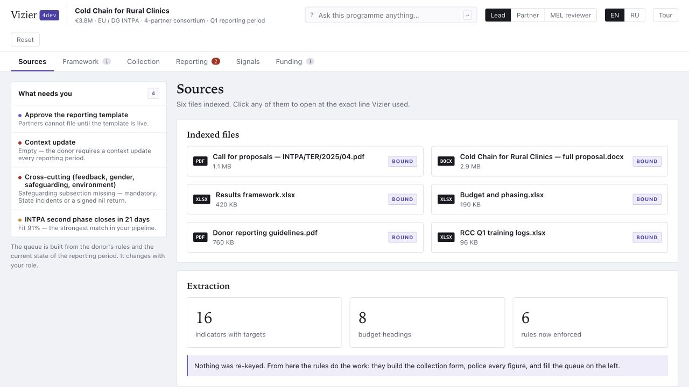

# Vizier4Dev

A bilingual browser prototype for quarterly reporting in grant-funded consortia: trace figures to source references, check indicator and cost rules, review partner returns, and prepare donor handover files.

**Status:** working demo on fictional data, with no backend, accounts, customers, or pilot. Donor handover prepares exports; it submits nothing.

[Open the demo](https://vizier4dev.pages.dev/) · [Programme-file contract](docs/programme-file.md)

[](https://vizier4dev.pages.dev/)

## Try it

Open [index.html](index.html) in a browser, or use the hosted demo. There is no build step or dependency installation. [landing.html](landing.html) is the public introduction.

Follow one fictional reporting period through:

1. **Framework and collection:** inspect indicators, budget lines, donor rules, and partner inputs.
2. **Checks:** see inconsistent totals, source conflicts, and cost-eligibility findings with their stated reasons.
3. **Partner returns:** export a return locally and import it into the lead's period. Wrong programme, period, partner, or malformed digest causes refusal.
4. **Review and handover:** switch lead, partner, and MEL-reviewer roles; resolve review items and prepare the donor export.

Role switching demonstrates the workflow in one browser. It does not authenticate a person or provide server-enforced access control.

## Load your own period

Use **Data → Download this one as a template**, edit the resulting programme file, then choose **Data → Load a programme file**. Review the [file contract](docs/programme-file.md) first.

A second worked programme and partner return are included:

- [Rural water points](examples/rural-water-points.json)
- [Partner return](examples/partner-return-oblast-vodokanal.json)

Loading your own programme removes staged narratives, canned review, and demo findings. Missing information stays missing; the checks, aggregation, partner-return validation, and handover gates continue to compute from the loaded data.

Files are read locally. The working period is saved in the current browser and restored on reload. Partner source files remain with the partner; exchanged returns contain reporting figures, local check statuses, and evidence digests. Review any export before sharing it.

A digest binds a return to declared evidence. It does not establish that evidence is correct or who supplied it. Human review and donor audit remain separate.

## Languages and limits

The interface supports English and Russian, with the selection remembered locally. Donor indicator codes, field labels, document contents, and partner names retain their source language.

The prototype supports one period in one browser. Partners exchange files; there is no shared workspace, concurrent editing, or quarterly history. The fictional demo illustrates rule handling, while actual thresholds and eligibility rules must come from the programme's grant agreement.

No network APIs or external scripts are used by the workspace. Local storage is not a managed confidential-data service. Outputs require human review before donor filing and do not constitute legal, financial, compliance, or audit advice.

## Development and deployment

```bash
python3 scripts/check_static.py
```

CI checks both pages, local links, the bilingual contract, absence of network APIs and external scripts, and response headers.

[deploy.sh](deploy.sh) validates and publishes only `index.html`, `landing.html`, `robots.txt`, and `_headers` to Cloudflare Pages. The [manual deployment workflow](.github/workflows/deploy.yml) uses the configured Cloudflare repository secrets.

The hosted demo is publicly reachable by its address, although crawling is disallowed. Use fictional data for the public demo. The landing page's founder and pricing drafts, and its personal contact address, remain open items before broader publication.

[MIT license](LICENSE).
